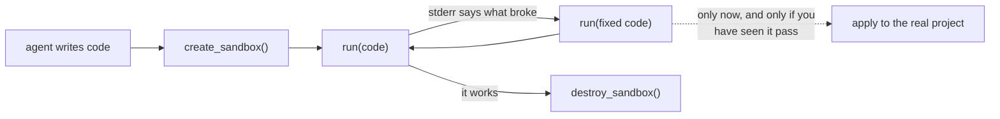

# HyperBox

**A local MCP server that runs LLM-generated code inside restricted
Docker containers.**

Your agent writes code and wants to run it. By default that happens on
your machine, against your files, with your credentials. Usually fine.
Occasionally it is `rm -rf`, a global install that breaks another
project, or a script that quietly talks to production.

HyperBox gives the agent somewhere else to run it: create a sandbox, run
in it as many times as you need, destroy it when done.



The loop matters more than any single call: the agent gets real stderr
and a real exit code, so it can fix the code and try again somewhere that
cannot hurt you — and only then touch your project.

## Why use it

- **Generated code runs somewhere other than your MCP client's process.**
  No access to your filesystem, your project, or the container engine.
- **Resource limits are set by the server**, not negotiable by the model:
  1 GB memory, 1 CPU, 128 processes, a 60-second ceiling, capped output —
  and they are read back off the real container, so a sandbox is never
  described as limited when it is not.
- **The network is sealed** before any submitted code runs. Declared
  dependencies install in a separate step that closes again afterwards.
- **Cleanup survives restarts.** Ownership lives in a registry outside
  your repo, so a restarted server — or a second one your client launched
  — can still find and destroy a sandbox it did not create.
- **Failure is reported honestly.** `run` returns real stdout, stderr and
  exit codes, and an unreachable engine is an error rather than a cheerful
  "already cleaned up".

## It contains hostile code — the proof, not the promise

`tests/verify_containment.py` runs genuinely dangerous code in a real
container. Actual output:

```
PASS  host filesystem is unreachable from inside
        stdout: 'DENIED: FileNotFoundError'
PASS  network is unreachable from inside
        stdout: 'DENIED: OSError'
PASS  container engine socket is not mounted
        stdout: 'engine sockets present: []'
PASS  memory exhaustion is capped, with a legible reason
        exit_code: 137 | stderr: Killed (SIGKILL): the sandbox exceeded its memory limit of 1g.
PASS  process explosion is capped by the PID limit
        stdout: 'DENIED after 126 processes: BlockingIOError'
PASS  sandbox is destroyed cleanly afterwards

6/6 contained
```

The fork bomb stopped at 126 processes against a ceiling of 128. Run it
yourself — that is why it ships as a test.

## Install and run

Requires **Python 3.11+** and **Docker** running.

```bash
git clone <this repository>
cd hyperbox
uv sync
uv run hyperbox doctor
```

`hyperbox doctor` checks your engine, the sandbox image, the registry,
and then creates a real sandbox, runs code in it and destroys it. It
exits 0 only if all of that worked, and every failure line names its fix.

Then register it with any MCP client that speaks stdio:

```json
{
  "mcpServers": {
    "hyperbox": {
      "command": "uv",
      "args": ["run", "--project", "/absolute/path/to/hyperbox", "hyperbox"],
      "env": { "PATH": "/usr/local/bin:/usr/bin:/bin" }
    }
  }
}
```

Use absolute paths, and make sure `PATH` includes your container engine's
CLI — MCP clients often launch servers with a trimmed environment.

## The tools

| Tool | What it does |
|---|---|
| `create_sandbox(language, backend, environment)` | A persistent, disposable container. Returns a `sandbox_id`. `backend` defaults to `auto`; `environment` picks a prebuilt image. |
| `run(sandbox_id, code, libraries, timeout)` | Executes code. Returns `{stdout, stderr, exit_code, success, timed_out}` — never a bare "it failed". |
| `destroy_sandbox(sandbox_id)` | Tears it down. Idempotent, and confirmed against the engine before it claims success. |

There is also a `hyperbox://capabilities` resource publishing the exact
limits, so an agent can read them instead of discovering them by failing.

**Language:** `python`. **Engines:** Docker and Podman, both passing the
full suite against real containers. `auto` picks whichever is running,
preferring Docker.

## Environments

Every sandbox starts from a base image. The default is a plain Python
image, so anything beyond the standard library is a package install on
each new sandbox. To start from something heavier — numpy and pandas
already present, say — build an environment once:

```bash
hyperbox build data-science --custom ./Dockerfile
hyperbox envs                      # what create_sandbox can now use
```

Then the agent asks for it by name:
`create_sandbox(environment="data-science")`. A running server picks up a
new environment without a restart.

**Building is a CLI action, deliberately.** A build runs whatever the
Dockerfile says — arbitrary commands, as root, with network access, under
none of the limits that apply to a sandbox. There is no tool that builds
an environment, so an agent can use what you made and cannot make one.

Selecting an environment changes only the base image. Every limit is
still applied and still read back off the real container, and a custom
image that cannot report results is refused like any other.

Within one sandbox the filesystem and installed packages persist between
runs; variables do not, because each run is a fresh process. Write what
you need to keep to `/work`.

## What it does not do

Be clear-eyed about the boundary:

- **Local containers share your host's kernel.** This is developer
  containment, not a claim of absolute isolation. A kernel exploit or a
  container escape reaches your machine. There is no gVisor, no
  Firecracker, no VM boundary that HyperBox itself provides.
- **It is not a multi-tenant boundary.** Do not use it to run untrusted
  third-party code as a service.
- **Code runs as root inside the container.** A non-root user was tried
  and breaks the execution backend's environment setup; the container
  boundary, `no-new-privileges` and the resource limits are what confine
  it. The reasoning is in
  [docs/security-model.md](docs/security-model.md).
- **Dependencies come from the public index** and are not vetted.

If you need a hard boundary for genuinely adversarial code, you want a VM
or microVM sandbox, not a local container.

## Documentation

- [Architecture](docs/architecture.md) — how the pieces fit, and why
- [Security model](docs/security-model.md) — what is enforced, and what is not
- [Troubleshooting](docs/troubleshooting.md) — every failure and its fix
- [Development](docs/development.md) — the rules, the suites, how to extend it

## Verify

```bash
uv run python tests/run_all.py docker
```

Every suite, against real containers, with a check that nothing was left
behind. There are no mocked tests on the sandbox path on purpose: mocking
Docker would prove only that the mock works.

## License

MIT — see [LICENSE](LICENSE).
