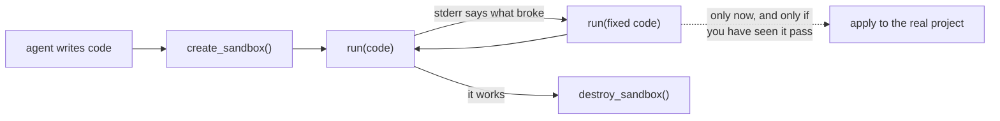

# HyperBox

**An MCP server that runs LLM-generated code in a disposable container,
so your agent can test its own work before it touches your project.**

[](https://pypi.org/project/hyperbox-mcp/)
[](https://pypi.org/project/hyperbox-mcp/)
[](LICENSE)

---

Your agent writes code and wants to run it. By default that happens on
your machine, against your files, with your credentials. Usually fine.
Occasionally it is `rm -rf`, a global install that breaks another
project, or a script that quietly talks to production.

HyperBox gives the agent somewhere else to run it.



The loop matters more than any single call: the agent gets real stdout,
stderr and exit codes, so it can fix its code and try again somewhere
that cannot hurt you — and only then touch your project.

## Quick start

```bash
pip install hyperbox-mcp     # or: uv tool install hyperbox-mcp
hyperbox doctor --pull       # check the machine, fetch the sandbox image
hyperbox config --format json
```

Merge that config into your MCP client and restart it. Full instructions,
including Cursor, Antigravity and Codeaira, are in
**[docs/setup.md](docs/setup.md)**.

Requires Python 3.11+ and either Docker or Podman.

## What your agent gets

| Tool | What it does |
|---|---|
| `create_sandbox(language, backend, environment)` | A persistent, disposable container. Returns a `sandbox_id`. |
| `run(sandbox_id, code, libraries, timeout)` | Executes code. Returns `{stdout, stderr, exit_code, success, timed_out}` — never a bare "it failed". |
| `destroy_sandbox(sandbox_id)` | Tears it down. Idempotent, and confirmed against the engine before it claims success. |

Plus a `hyperbox://capabilities` resource publishing the exact limits, so
an agent can read them instead of discovering them by failing.

Within one sandbox, the filesystem and installed packages persist between
runs; variables do not, because each run is a fresh process. Write what
you need to keep to `/work`.

## Why use it

- **Generated code runs outside your client's process.** No access to
  your filesystem, your project, or the container engine.
- **Limits are server policy, not negotiable by the model** — 1 GB
  memory, 1 CPU, 128 processes, a 60-second ceiling, capped output. They
  are read back off the real container, so a sandbox is never *described*
  as limited when it is not.
- **The network is sealed** before any submitted code runs. Declared
  dependencies install in a separate step that closes again afterwards.
- **Cleanup survives restarts.** Ownership lives in a registry outside
  your repo, so a restarted server — or a second one your client launched
  — can still find and destroy a sandbox it did not create.
- **Failure is reported honestly.** An unreachable engine is an error,
  not a cheerful "already cleaned up".

## It contains hostile code — the proof, not the promise

`tests/verify_containment.py` runs genuinely dangerous code in a real
container. Actual output:

```
PASS  host filesystem is unreachable from inside
        stdout: 'DENIED: FileNotFoundError'
PASS  network is unreachable from inside
        stdout: 'DENIED: OSError'
PASS  container engine socket is not mounted
        stdout: 'engine sockets present: []'
PASS  memory exhaustion is capped, with a legible reason
        exit_code: 137 | stderr: Killed (SIGKILL): the sandbox exceeded its memory limit of 1g.
PASS  process explosion is capped by the PID limit
        stdout: 'DENIED after 126 processes: BlockingIOError'
PASS  sandbox is destroyed cleanly afterwards

6/6 contained
```

The fork bomb stopped at 126 processes against a ceiling of 128. Run it
yourself — that is why it ships as a test.

## Custom environments

Start sandboxes from a heavier image so you do not pay a package install
every time:

```bash
hyperbox build data-science --custom ./Dockerfile
hyperbox envs
```

Your agent then asks for it by name:
`create_sandbox(environment="data-science")`. A running server picks up a
new environment without a restart.

Building is a CLI action on purpose — an agent can use an environment,
but cannot create one. See [docs/security.md](docs/security.md).

## What it does not do

Be clear-eyed about the boundary:

- **Local containers share your host's kernel.** This is developer
  containment, not absolute isolation. There is no gVisor, no
  Firecracker, no VM boundary that HyperBox itself provides.
- **It is not a multi-tenant boundary.** Do not use it to run untrusted
  third-party code as a service.
- **Code runs as root inside the container.** A non-root user was tried
  and breaks the execution backend; the reasoning is in
  [docs/security.md](docs/security.md).
- **Dependencies come from the public index** and are not vetted.

If you need a hard boundary for genuinely adversarial code, you want a VM
or microVM sandbox, not a local container.

## Documentation

- **[Setup](docs/setup.md)** — install, client configuration, environments, CLI reference
- **[Security model](docs/security.md)** — what is enforced, how it is proven, what it does not cover
- **[Troubleshooting](docs/troubleshooting.md)** — when something does not work
- **[Changelog](CHANGELOG.md)**
- **[Contributing](CONTRIBUTING.md)**

## Testing

There are no mocks on the sandbox path, on purpose — mocking Docker would
prove only that the mock works. Every acceptance suite runs against a real
container:

```bash
python tests/run_all.py docker      # and: podman
```

Takes 5–15 minutes. It also asserts that no containers were left behind.

## License

MIT. See [LICENSE](LICENSE).
