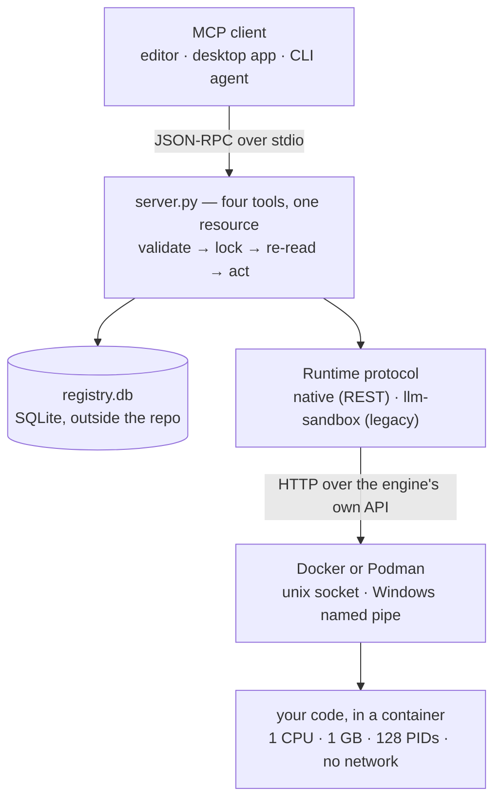

# How HyperBox works

A tour of the system for someone who wants to understand it before
trusting it, or before changing it. The [security model](security.md)
covers what is enforced; this covers how the pieces fit.

## The shape of it



Five layers, and the two seams that matter are **MCP** (between client
and server) and **the engine's REST API** (between runtime and engine).
Everything hard lives at one of them.

## One server process per client

The server speaks JSON-RPC over stdio. That has a consequence worth
knowing: **stdout is the protocol channel**, so nothing may print to it.
The server writes to `~/.hyperbox/logs/server.log` instead, which
`hyperbox logs` reads.

A client may start several servers, or restart one at any time. That is
why ownership does not live in memory — see the registry below.

## The four tools, and the one that isn't

| Tool | |
|---|---|
| `create_sandbox` | make one, optionally with packages and your files |
| `run` | execute code, foreground or background |
| `get_process_logs` | read a background run's output |
| `destroy_sandbox` | tear it down |

**`hyperbox build` is deliberately not a tool.** Building an environment
runs arbitrary commands, as root, with network, under none of a
sandbox's limits. An agent can *use* an environment a person built; it
cannot make one. The same reasoning keeps `hyperbox pull` — which writes
files onto your disk — out of the tool surface.

An MCP client has no dispatcher: it decides whether to call a tool from
the tool's name, description and annotations alone. So the prose in
`server.py` is load-bearing, and every tool description says what it is
for *and when not to use it*.

`hyperbox://capabilities` publishes the exact limits, the languages, the
environments and their network posture, and a `host_actions` block naming
the commands an agent must ask a human to run. It exists so an agent
plans against the ceilings instead of discovering them by failing.

## Every tool body runs in one order

```
validate  →  take the per-sandbox lock  →  re-read the record  →  act
```

A decision made on state read *before* the lock is already stale. The
lock is a `flock` on a per-sandbox file, so the OS releases it if the
holder is killed — a crashed server must not wedge a sandbox forever.

## The registry: ownership that outlives the process

A container outlives the process that made it, so its ownership record
has to as well. `~/.hyperbox/state/registry.db` is SQLite in WAL mode,
shared by every HyperBox process on the machine.

Two invariants:

1. **The row is written before the container exists**, in state
   `creating`. Garbage collection ignores that state, so nothing can
   reclaim a container in the window between the engine making it and the
   server recording it.
2. **Every state change happens under the per-sandbox lock**, re-reading
   the record inside it.

This is what lets a restarted client — or a second one — destroy a
sandbox it did not create. Sandboxes nobody touches are reclaimed after
an inactivity timeout.

## The Runtime boundary

The tools talk only to the `Runtime` protocol in `runtime.py`. Two
implementations exist:

- **`native`** (the default) speaks the engine's REST API directly, over
  a unix socket or a Windows named pipe.
- **`llm-sandbox`** is the previous backend, kept one release as an
  escape hatch. It is selected with `HYPERBOX_RUNTIME=llm-sandbox` and
  goes away in a future version.

The boundary is why a second backend was possible at all. Container
invariants shared by both — the resource read-back, network sealing, the
OOM explanation, orphan collection — live in `sandbox_ops.py`, so a
second backend shares the *behaviour* rather than a description of it.

## Creating a sandbox, in order

The order is the design, not an implementation detail:

1. Reserve the registry row (`creating`).
2. Create the container with its limits, and **read them back off the
   running container**. A mismatch destroys it and fails.
3. Start it, on a normal network.
4. Copy in `sync_in_dir`, if given.
5. Install `packages`, if given. **No submitted code has run yet.**
6. Detach every network, and **verify** the seal from inside with a TCP
   connection and a DNS lookup — both must fail.
7. Only now is the sandbox handed back, and the row marked `ready`.

Step 2 and step 6 are the same idea twice: *do not verify a safety
property against the thing you asked; verify it against the thing that
answered.* An engine that accepts a limit and applies nothing would
otherwise hand back a container the server goes on describing as limited.

The one exception is an environment a human built with
`--allow-network`, which skips steps 6 and says so in the result and in
`capabilities`. See the [security model](security.md).

## Running code

Submitted code is written into the container **as a file, through the
engine's archive API** — never interpolated into a shell command. Nothing
is quoted, so nothing can be mis-quoted. The shell only ever sees a
quoted path.

A foreground run is bounded by a timeout, and when it expires the code is
actually killed: the process **group** is signalled, so anything the code
forked dies with it, and the kill is verified by reading `/proc` through
the interpreter that is already PID 1. Not `ps` or `pkill` — those live in
`procps`, which the slim language images do not ship, and a kill that
depends on a binary the image may not have is a kill that silently does
nothing.

A background run is started and let go, its output accumulating in a
capped file inside the container. Loopback still works in a sealed
sandbox, so a foreground run can talk to a background server on
`127.0.0.1`.

## Concurrency

Several HyperBox servers commonly run at once — two editors, an agent in
a terminal, a second window of the same client — all driving one engine
over one socket.

- **Creates, pulls and builds** take a slot from a file-based semaphore,
  so the bound holds *across processes*. A semaphore inside one process
  would not know the other three exist.
- **`run` is deliberately not guarded.** An exec is a lightweight call on
  a connection that already exists; contention is at connection setup.
  Putting a file lock on the hot path would add latency to solve a
  problem it does not cause.

See [agent teams](agent-teams.md) for what that means when several
subagents work at once.

## Where things are

```
src/hyperbox_mcp/
  server.py          the MCP surface: four tools, one resource, one prompt
  policy.py          every server-set limit, and the host paths
  validate.py        strict checks on caller input
  runtime.py         the Runtime protocol
  native_runtime.py  the default backend
  rest/              transport, client and API wrappers for the engine
  sandbox_ops.py     invariants shared by every backend
  registry.py        durable ownership, shared across processes
  engine.py          engine discovery and identity
  slots.py           cross-process bound on heavy engine work
  errors.py          one structured failure shape
  cli.py, doctor.py, builder.py, lifecycle.py, clientconfig.py
tests/               seven acceptance suites, all against real containers
```

## Testing

There are **no mocks on the sandbox path**, on purpose: mocking Docker
would prove only that the mock works. Every suite runs against a real
container, which is why they take minutes.

The suites split along a line worth knowing:

- **behavioural** — run genuinely hostile code and prove it is contained
- **structural** — read the real container's attributes back and assert
  the controls are *present*

Both are needed. Only the structural one catches a control that is absent
but happens not to be exercised. And for anything whose purpose is a side
effect — a limit, a kill, a seal, a refusal — the check is expected to
have been *seen to fail* before it is trusted.
